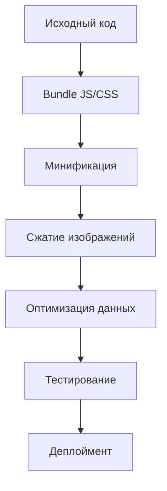

# План подготовки к публикации PWA словаря

## Текущий статус проекта
- Статический сайт без процесса сборки
- PWA с Service Worker для кэширования
- Большие файлы данных словарей (NDJSON)
- Зависимости Framework7 отсутствуют в проекте (vendor/ папка не существует)
- Сервер: npm start (npx serve)

## Основные проблемы
1. **Отсутствие процесса сборки**: Нет минификации, бандлинга JS/CSS
2. **Большие файлы данных**: dabkrs-light.ndjson (~10-20MB?) - не оптимизированы
3. **Отсутствующие зависимости**: Framework7 файлы не включены в репозиторий
4. **Нет сжатия изображений**
5. **Нет тестирования производительности**

## Рекомендации по подготовке к публикации

### 1. Процесс сборки
- **Внедрить bundler**: Webpack, Rollup или Vite для JS/CSS
- **Минификация**: Уменьшить размер JS/CSS на 30-50%
- **Code splitting**: Разделить JS на chunks (app, db, pinyin)
- **Tree shaking**: Удалить неиспользуемый код

### 2. Оптимизация данных
- **Сжатие словарей**: Использовать GZIP/Brotli на сервере
- **Ленивая загрузка**: Загружать словари по частям или по требованию
- **Формат данных**: Рассмотреть IndexedDB с предварительной обработкой
- **Кэширование**: Обновить Service Worker для эффективного кэширования больших файлов

### 3. Оптимизация изображений
- **Сжатие иконок**: WebP формат для PWA иконок
- **Responsive images**: Разные размеры для разных устройств

### 4. Деплоймент
- **Статический хостинг**: Netlify, Vercel, GitHub Pages
- **CDN**: Cloudflare для глобального распределения
- **HTTPS**: Обязательно для PWA
- **Service Worker**: Настроить для офлайн работы

### 5. Кросс-платформенная совместимость
- **Тестирование**: iOS Safari, Android Chrome, Desktop browsers
- **Manifest**: Проверить PWA установку
- **Touch gestures**: Убедиться в работе на мобильных

### 6. Производительность
- **Lighthouse audit**: Цель 90+ баллов
- **First Contentful Paint**: <1.5s
- **Bundle size**: <500KB для начальной загрузки

## Mermaid диаграмма процесса сборки

## Следующие шаги
1. Установить Framework7 локально
2. Настроить процесс сборки
3. Оптимизировать словари
4. Провести тестирование
5. Подготовить к деплою